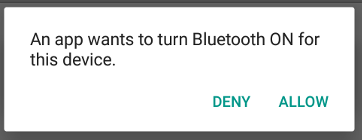
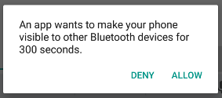
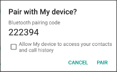

## Android 蓝牙技术（一）- 经典蓝牙

[Android 蓝牙技术（一）- 经典蓝牙](bluetooth_a.md)

[Android 蓝牙技术（二）- 低功耗蓝牙](bluetooth_b.md)

[配套设备配对](bluetooth_c.md)

Android平台支持蓝牙设备通过蓝牙协议栈来实现无线通信。应用层提供了Bluetooth APIs来使用蓝牙功能，
这些API可以使应用可以无线连接其他蓝牙设备实现点对点及多点间通信。

使用Bluetooth APIs,应用可以实现以下功能:
- 扫描其他蓝牙设备
- 在本地蓝牙适配器查询已配对的设备
- 建立RFCOMM通道
- 通过服务发现连接其他设备
- 与其他设备进行数据交互
- 管理多连接

本篇主要讲经典蓝牙技术，经典蓝牙适合耗电操作，包括流传输及Android设备间通信。对于有低功耗需求的蓝牙设备
Android 4.3 (API level 18) 提供了低功耗蓝牙相关的API。

### 准备工作
要在蓝牙设备间发送数据，必须先通过配对步骤组成通道。一个可被发现的设备来接收连接请求，另一个设备通过服务发现步骤
来发现此设备，可被发现的设备接收配对请求，两个设备交换安全码完成绑定骤。安全码会被设备缓存供以后使用。完成配对和
绑定步骤，设备开始交换数据，会话完成后，由发起配对请求的设备释放连接通道。两个设备保持绑定状态，这样，之后在蓝牙
范围之内且两个设备都没有移除绑定时就可以自动重新连接建立会话。

#### 蓝牙权限
要使用蓝牙特性，必须声明两个权限。第一个是BLUETOOTH，进行蓝牙通信时需要此权限，如发起连接，接受连接和交换数据。

另一个权限是 ACCESS_FINE_LOCATION。之所以需要这个权限是因为蓝牙扫描可被用来收集用户的位置信息，这些信息可能来自于
用户的设备以及商店及公共场所使用的蓝牙信标。

另外，在 Android 8.0 (API level 26)及以上设备上，可通过CompanionDeviceManager来扫描附近配套设备而不需要位置权限。

**注意：**如果应用 targets 为 Android 9 (API level 28)及以下，可声明 ACCESS_COARSE_LOCATION 权限替代 ACCESS_FINE_LOCATION。

如果你的APP要发起设备发现或者操作蓝牙设置，除了 BLUETOOTH 权限外还要声明 BLUETOOTH_ADMIN 权限。多数具有发现周围蓝牙设备功能
的应用需要这项权限，至于这项权限其他的功能，除非是电池管理类应用需要根据用户需要修改蓝牙设备，否则不建议使用。

在 manifest 文件中声明权限：
```
<manifest ... >
  <uses-permission android:name="android.permission.BLUETOOTH" />
  <uses-permission android:name="android.permission.BLUETOOTH_ADMIN" />

  <!-- If your app targets Android 9 or lower, you can declare
       ACCESS_COARSE_LOCATION instead. -->
  <uses-permission android:name="android.permission.ACCESS_FINE_LOCATION" />
  ...
</manifest>
```
### 使用不同配置
从Android3.0开始，Bluetooth API便支持使用蓝牙配置文件，蓝牙配置文件是设备间基于蓝牙通信的无线接口规范。例如免提配置。
例如移动电话要连接无线耳机，两种设备都需要支持免提配置。

Android Bluetooth API 提供了以下几种蓝牙配置的实现：
- **Headset.** Headset 配置支持耳机和手机一起使用。Android 提供了 BluetoothHeadset 类，该类是控制蓝牙耳机服务的代理类，
包含了蓝牙耳机和免提(v1.5)配置。该类还包含对 AT 命令的支持。
- **A2DP.**蓝牙立体声音频传输配置(A2DP)文件定义了高质量音频如何通过流式传输从一个设备传输到另一个设备。Android 提供了 BluetoothA2dp
类，该类是控制蓝牙A2DP服务的代理类。
- **Health Device.** Android 4.0 (API level 14)开始引入了对蓝牙健康设备 (HDP)配置文件的支持。改配置支持你创建通过蓝牙和
蓝牙健康设备之间通信的应用，如心率仪、血压计、体温计及台秤等。有关已支持的设备及对应的规范码，参照[HDP Device Data Specializations](https://www.bluetooth.com/specifications/assigned-numbers/health-device-profile/).
这些值在 ISO/IEEE 11073-20601 规范的“命名法规附录”中也被称为 MDC_DEV_SPEC_PROFILE_*。详情参见[健康设备配置文件](#健康设备配置文件)。

以下是使用配置文件的基本步骤：

1. 获取默认适配器，参阅[设置蓝牙](#设置蓝牙)
2. 设置 BluetoothProfile.ServiceListener，此侦听器会在连接上和断开连接时通知 BluetoothProfile 客户端。
3. 使用 getProfileProxy() 与配置文件关联的配置代理对象建立连接，下面例子中，配置代理对象是 BluetoothHeadset 实例。
4. 在 onServiceConnected() 中获取配置代理对象句柄。
5. 一旦拿到了配置代理对象，你可以使用它监测连接的状态及进行其他相关操作。

例如，这段代码展示了如何连接到 BluetoothHeadset 代理对象，以便控制耳机配置文件：
```
var bluetoothHeadset: BluetoothHeadset? = null

// Get the default adapter
val bluetoothAdapter: BluetoothAdapter? = BluetoothAdapter.getDefaultAdapter()

private val profileListener = object : BluetoothProfile.ServiceListener {

    override fun onServiceConnected(profile: Int, proxy: BluetoothProfile) {
        if (profile == BluetoothProfile.HEADSET) {
            bluetoothHeadset = proxy as BluetoothHeadset
        }
    }

    override fun onServiceDisconnected(profile: Int) {
        if (profile == BluetoothProfile.HEADSET) {
            bluetoothHeadset = null
        }
    }
}

// Establish connection to the proxy.
bluetoothAdapter?.getProfileProxy(context, profileListener, BluetoothProfile.HEADSET)

// ... call functions on bluetoothHeadset

// Close proxy connection after use.
bluetoothAdapter?.closeProfileProxy(BluetoothProfile.HEADSET, bluetoothHeadset)
```
#### 供应商特定的 AT 指令
3.0 (API level 11)开始，应用可以注册能接收到耳机发送的预定义的厂商特定 AT 指令的广播 (如 Plantronics +XEVENT 命令)。
例如应用可收到指示已连接设备电池电量的广播，然后通知用户根据需要采取操作。以 ACTION_VENDOR_SPECIFIC_HEADSET_EVENT Intent 注册广播
来处理厂商特定的耳机 AT 指令。

### 健康设备配置文件
Android 4.0 (API level 14) 引入对健康设备配置文件(HDP)支持。相关API包括 BluetoothHealth, BluetoothHealthCallback, 和 BluetoothHealthAppConfiguration, 参见[关键类和接口](#关键类和接口)。

在使用  Bluetooth Health API 时，理解以下 HDP 概念会有帮助：

**Source**
一个健康设备-如体重秤或血糖仪，发送医学数据给智能设备，如手机或平板。
**Sink**
智能设备接收医学数据，在一个 Android HDP 应用中，由 BluetoothHealthAppConfiguration 对象来表示。
**Registration**
注册Sink来与特定设备交互的过程。
**Connection**
在健康设备(Source)和智能设备(Sink)间创建通道的过程。

#### 创建 HDP 应用
以下是基本步骤：

1. 获取 BluetoothHealth 代理对象引用，与耳机和 A2DP 配置设备类似，你必须使用 BluetoothProfile.ServiceListener 和健康配置文件类型调用 getProfileProxy()
来和配置代理对象建立连接。
2. 创建  BluetoothHealthCallback 并注册健康接收设备配置(BluetoothHealthAppConfiguration)。
3. 创建和健康设备间的连接。**注意：**有些设备会自动发起连接，对于这类设备就不需要进行这一步了。
4. 连接成功后，通过文件描述符进行读/写操作，收到的数据需要使用实现了[IEEE 11073](https://standards.ieee.org/project/index.html)规范的健康管理器进行解释。
5. 完成后，关闭健康通道并取消注册应用，该通道在长期闲置后也会关闭。

### 设置蓝牙
在使用蓝牙通信之前，首先要验证设备是否支持蓝牙并确保蓝牙功能开启。

如果设备不支持蓝牙，则应停用蓝牙相关功能。如果蓝牙未开启，则可以请求用户在应用内开启蓝牙。这可以使用 BluetoothAdapter 在两步内实现:

1. 获取 BluetoothAdapter

    所有蓝牙蓝牙活动都需要 BluetoothAdapter，调用静态方法 getDefaultAdapter() 可获得 BluetoothAdapter 对象。整个系统中只有一个蓝牙适配器，你的应用可使用
    此对象与之进行交互。如果 getDefaultAdapter() 返回 null，则说明设备不支持蓝牙。例如：
    ```
    val bluetoothAdapter: BluetoothAdapter? = BluetoothAdapter.getDefaultAdapter()
    if (bluetoothAdapter == null) {
        // Device doesn't support Bluetooth
    } 
    ```
2. 开启蓝牙

    接下来，你需要保证蓝牙是开启的，调用 isEnabled() 检查当前蓝牙是否开启，如果此方法返回 false 则蓝牙未开启。调用 startActivityForResult() 在 Intent
    传入 ACTION_REQUEST_ENABLE action。这步调用可在应用内通过系统设置请求开启蓝牙。例如：
    ```
    if (bluetoothAdapter?.isEnabled == false) {
        val enableBtIntent = Intent(BluetoothAdapter.ACTION_REQUEST_ENABLE)
        startActivityForResult(enableBtIntent, REQUEST_ENABLE_BT)
    }
    ```
    
    如上图，会展示一个请求用户授权打开蓝牙的对话窗。如果用户点击允许，系统则开始打开蓝牙，并且一旦此过程完成或失败焦点会回到应用。
    REQUEST_ENABLE_BT 常量是本地定义的大于0的整型。系统会将此参数作为 requestCode 传递给你的 onActivityResult() 实现。
    如果开启成功，在 onActivityResult() 回调中会收到 RESULT_OK 结果码。如果由于错误未能开启蓝牙或者用户点击了拒绝，则结果码为
    RESULT_CANCELED。

你的应用还可选择侦听 ACTION_STATE_CHANGED 广播，每当蓝牙状态发生变化时，系统会发送此广播。此广播包括额外字段 EXTRA_STATE 和 EXTRA_PREVIOUS_STATE，
二者分别包含蓝牙新旧状态。可能的值有 STATE_TURNING_ON, STATE_ON, STATE_TURNING_OFF,和 STATE_OFF。如果你的应用需要监听运行时蓝牙状态变化，请侦听此
广播。

**注意：** 开启可检测性会自动开启蓝牙。如果你计划在进行蓝牙活动前打开设备可检测性，可省略上面的步骤2。详情阅读[启用可检测性](#启用可检测性)部分。


### 查找设备
使用 BluetoothAdapter，你可以通过设备发现或已配对列表查找远程设备。

设备发现是一个扫描过程，可以搜索局部区域内开启蓝牙的设备并请求与每台设备相关的信息。这一过程有时被称为发现、询问或扫描。然后，只有通过启用可检测性当前可接收
信息时，一个邻近蓝牙设备才能响应发现请求。如果一个设备是可检测的，在响应发现请求时会分享一些信息，例如设备的名称、类及其唯一的 MAC 地址。
利用这些信息，进行检测的设备可与被检测设备发起连接。

一旦连接建立，用户会自动收到配对请求。当设备配对成功后，关于设备的基础信息，如设备名称、类和 MAC 地址会被保存下来，可通过蓝牙 API 读取。
假设设备在有效范围内，利用已知的 MAC 地址，你可以在任意时刻发起连接而不需要进行发现
操作。

注意配对和连接之间存在区别：
- 配对意味着两个设备知道对方的存在，具有用于认证的共享链路密匙，并且能够建立加密连接。
- 连接意味着设备当前共享一个 RFCOMM 通道，并能互相传输数据。目前 Android 蓝牙 API
需要设备在建立 RFCOMM 通道前先进行配对。

以下部分介绍如何查找已配对的设备，或使用设备发现功能来发现新设备。
**注意：**Android 设备默认处于不可检测状态。用户可通过系统设置使设备在有限的时间
内可被检测，或者应用可以在不离开应用的情况下请求用户开启可检测性。详情参见本页[启用可检测性](#启用可检测性)

#### 查询已配对设备
进行发现设备之前，最好查询下配对设备列表确认目标设备是否已知。调用 getBondedDevices() 会
返回代表已配对设备的 BluetoothDevice 对象集合。如下面代码展示的，你可以查询所有
已配对设备获取每个设备的名称和 MAC 地址：
```
val pairedDevices: Set<BluetoothDevice>? = bluetoothAdapter?.bondedDevices
pairedDevices?.forEach { device ->
    val deviceName = device.name
    val deviceHardwareAddress = device.address // MAC address
}
```
要发起连接，只需要从关联的 BluetoothDevice 对象获取 MAC 地址，调用 getAddress() 方法
可获得。更多参见[连接设备](#连接设备)章节。


#### 发现设备
调用 startDiscovery() 开始发现设备操作，此操作为异步操作，布尔返回值代表发现
操作是否成功启动。发现操作包含12秒的查询扫描，随后会对每个发现的设备进行页面扫描以
获取其蓝牙名称。

你的应用必须要针对 ACTION_FOUND Intent 注册广播，以便收到每个被发现设备的信息。
系统会为每个设备广播此 Intent,Intent 包含 EXTRA_DEVICE 和 EXTRA_CLASS 额外字段，
分别包含一个 BluetoothDevice 和一个 BluetoothClass。以下代码展示如何在发现设备
时注册并处理广播：
```
override fun onCreate(savedInstanceState: Bundle?) {
    ...

    // Register for broadcasts when a device is discovered.
    val filter = IntentFilter(BluetoothDevice.ACTION_FOUND)
    registerReceiver(receiver, filter)
}

// Create a BroadcastReceiver for ACTION_FOUND.
private val receiver = object : BroadcastReceiver() {

    override fun onReceive(context: Context, intent: Intent) {
        val action: String = intent.action
        when(action) {
            BluetoothDevice.ACTION_FOUND -> {
                // Discovery has found a device. Get the BluetoothDevice
                // object and its info from the Intent.
                val device: BluetoothDevice =
                        intent.getParcelableExtra(BluetoothDevice.EXTRA_DEVICE)
                val deviceName = device.name
                val deviceHardwareAddress = device.address // MAC address
            }
        }
    }
}

override fun onDestroy() {
    super.onDestroy()
    ...

    // Don't forget to unregister the ACTION_FOUND receiver.
    unregisterReceiver(receiver)
}
```

#### 启用可检测性
如果您希望将本地设备设为可被其他设备检测到，请使用 ACTION_REQUEST_DISCOVERABLE
Intent 调用 startActivityForResult(Intent, int)。这样可在应用内发起开启可检测性模式
的请求，无须跳转至设置页，也不会暂停你的应用。默认情况下，设备可被检测时间为120秒即
2分钟。通过添加 EXTRA_DISCOVERABLE_DURATION Extra 属性，最高可设置为3600秒即
1小时。

**警告：** 如果您将 EXTRA_DISCOVERABLE_DURATION Extra 属性的值设置为 0，则设备
将始终处于可检测到模式。此配置安全性低，因而非常不建议使用。

以下代码段将设备处于可检测到模式的时间设置为 5 分钟（300 秒）：
```
val discoverableIntent: Intent = Intent(BluetoothAdapter.ACTION_REQUEST_DISCOVERABLE).apply {
    putExtra(BluetoothAdapter.EXTRA_DISCOVERABLE_DURATION, 300)
}
startActivity(discoverableIntent)
```


如上图，系统会显示对话框，请求用户允许设备设置为可检测模式。如果用户响应“Yes”，
则设备会变为可检测到模式，并在指定时间内保持该模式。在 Activity 的 onActivityResult()
中会收到回调，结果码的值等于设备可被检测的时间，若用户响应 "No" 或发生了错误则结果
码为 RESULT_CANCELED。

**注意：**如果尚未在设备上启用蓝牙，则启用设备可检测性会自动启用蓝牙。

设备将在分配的时间内以静默方式保持可检测到模式。如果您希望在可检测到模式发生变化时
收到通知，则可以为 ACTION_SCAN_MODE_CHANGED Intent 注册 BroadcastReceiver。
此 Intent 将包含额外字段 EXTRA_SCAN_MODE 和 EXTRA_PREVIOUS_SCAN_MODE，二者分
别提供新的和旧的扫描模式。每个 Extra 属性可能拥有以下值：

SCAN_MODE_CONNECTABLE_DISCOVERABLE : 设备处于可检测到模式。

SCAN_MODE_CONNECTABLE : 设备未处于可检测到模式，但仍能收到连接。

SCAN_MODE_NONE ：设备未处于可检测到模式，且无法收到连接。

如果您要发起对远程设备的连接，则无需启用设备可检测性。只有应用在管理一个服务端 socket
接收传入的连接时才需要开启可检测性。因为远程设备在发起连接之前必须要能发现这些设备。

### 连接设备
如要在两台设备之间创建连接，您必须同时实现服务器端和客户端机制，因为其中一台设备
必须开放服务器套接字，而另一台设备必须使用服务器设备的 MAC 地址发起连接。服务器
设备和客户端设备均会以不同方法获得所需的 BluetoothSocket。接受传入连接后，服务
器会收到套接字信息。在打开与服务器相连的 RFCOMM 通道时，客户端会提供套接字信息。

当服务器和客户端在同一 RFCOMM 通道上分别拥有已连接的 BluetoothSocket 时，即
可将二者视为彼此连接。这种情况下，每台设备都能获得输入和输出流式传输，并开始传输数据，
相关详细介绍请参阅[管理连接](#管理连接)部分。

#### 连接技术
一个实现方式是自动将每个设备准备为服务端，这样每个设备都具有可打开或侦听的服务端
套接字。在此情况下，任一设备都可发起与另一台设备的连接，并成为客户端。或者，其中
一台设备可显式托管连接并按需开放一个服务器套接字，而另一台设备则发起连接。



**注意：**如果两台设备之前尚未配对，则在连接过程中，Android 框架会自动向用户显示配对
请求通知或对话框（如上图）。因此，在尝试连接设备时，您的应用无需担心设备是否已配对。
在用户成功配对两台设备之前，您的 RFCOMM 连接尝试会一直阻塞，并且如果用户拒绝配对，
或者配对过程失败或超时，则该尝试便会失败。

#### 作为服务器连接
当您需要连接两台设备时，其中一台设备必须保持开放的 BluetoothServerSocket,从而充当服务器。
服务器套接字的用途是侦听传入的连接请求，并在接受请求后提供已连接的 BluetoothSocket。
从 BluetoothServerSocket 获取 BluetoothSocket 后，您可以（并且应该）舍弃
BluetoothServerSocket，除非您的设备需要接受更多连接。

要设置服务器并接收连接，请完成以下几个步骤：

1. 通过调用 listenUsingRfcommWithServiceRecord() 获取 BluetoothServerSocket。
该字符串是服务的可识别名称，系统会自动将其写入到设备上的新服务发现协议 (SDP) 数据库条目。
此名称没有限制，可直接使用您的应用名称。 SDP 条目中也包含通用唯一标识符 (UUID)，
这也是客户端设备连接协议的基础。换言之，当客户端尝试连接此设备时，它会携带 UUID，
从而对其想要连接的服务进行唯一标识。为了让服务器接受连接，这些 UUID 必须互相匹配。

UUID 是一种标准化的 128 位格式，可供字符串 ID 用来对信息进行唯一标识。UUID
的特点是其足够庞大，因此您可以选择任意随机 ID，而不会与其他任何 ID 发生冲突。在本例中，其用于对应用的蓝牙服务进行唯一标识。如要获取供应用使用的 UUID，您可以从网络上的众多随机 UUID 生成器中任选一种，然后使用 fromString(String) 初始化一个 UUID。

2. 通过调用 accept() 开始侦听连接请求。
这是一个阻塞调用。当服务器接受连接或异常发生时，该调用便会返回。只有当远程设备发送包含 UUID 的连接请求，并且该 UUID 与使用此侦听服务器套接字注册的 UUID 相匹配时，服务器才会接受连接。
连接成功后，accept() 将返回已连接的 BluetoothSocket。

3. 如果您无需接受更多连接，请调用 close()。
此方法调用会释放服务器套接字及其所有资源，但不会关闭 accept() 所返回的已连接的 BluetoothSocket。
与 TCP/IP 不同，RFCOMM 一次只允许每个通道有一个已连接的客户端，因此大多数情况下，在接受已连接的套接字后，您可以立即在 BluetoothServerSocket 上调用 close()。

由于 accept() 是阻塞调用，因此您不应在主 Activity 界面线程中执行该调用，这样您的应用才仍然可以响应其他用户的交互。
通常，您可以在应用所管理的新线程中完成所有涉及 BluetoothServerSocket 或 BluetoothSocket 的工作。
如要取消 accept() 等被阻塞的调用，请通过另一个线程，在 BluetoothServerSocket 或 BluetoothSocket 上调用 close()。
请注意，BluetoothServerSocket 或 BluetoothSocket 中的所有方法都是线程安全的方法。

服务器组件可通过以下简化线程接受传入连接：
```
private inner class AcceptThread : Thread() {
    
    private val mmServerSocket: BluetoothServerSocket? by lazy(LazyThreadSafetyMode.NONE) {
        bluetoothAdapter?.listenUsingInsecureRfcommWithServiceRecord(NAME, MY_UUID)
    }

    override fun run() {
        // Keep listening until exception occurs or a socket is returned.
        var shouldLoop = true
        while (shouldLoop) {
            val socket: BluetoothSocket? = try {
                mmServerSocket?.accept()
            } catch (e: IOException) {
                Log.e(TAG, "Socket's accept() method failed", e)
                shouldLoop = false
                null
            }
            socket?.also {
                manageMyConnectedSocket(it)
                mmServerSocket?.close()
                shouldLoop = false
            }
        }
    }

    // Closes the connect socket and causes the thread to finish.
    fun cancel() {
        try {
            mmServerSocket?.close()
        } catch (e: IOException) {
            Log.e(TAG, "Could not close the connect socket", e)
        }
    }
}
```
在此示例中，只需要一个传入连接，因此在接受连接并获取 BluetoothSocket 之后，应用会立即将获取的 BluetoothSocket 传送到单独的线程、关闭 BluetoothServerSocket 并中断循环。

请注意，如果 accept() 返回 BluetoothSocket，则表示已连接套接字。因此，不需要像客户端那样调用 connect()。

应用特定的 manageMyConnectedSocket() 方法旨在启动用于传输数据的线程（详情请参阅[管理连接](#管理连接)部分）。

通常，在完成传入连接的侦听后，应立即关闭 BluetoothServerSocket。在此示例中，获取 BluetoothSocket 后会立即调用 close()。此外，还可以在线程中提供一个公共方法，以便在需要停止侦听服务器套接字时关闭私有 BluetoothSocket。

#### 作为客户端连接
要与远程服务端设备建立连接，首先要获取代表远程设备的 BluetoothDevice  对象。
关于如何创建 BluetoothDevice 对象，参见[查找设备](#查找设备)。然后通过 BluetoothDevice 获取 BluetoothSocket 对象来建立连接。

基本步骤如下：
1. 使用 BluetoothDevice，通过调用 createRfcommSocketToServiceRecord(UUID) 获取 BluetoothSocket。
此方法会初始化 BluetoothSocket 对象，以便客户端连接至 BluetoothDevice。此处传递的 UUID 必须与服务器设备在调用 listenUsingRfcommWithServiceRecord(String, UUID) 开放其 BluetoothServerSocket 时所用的 UUID 相匹配。
如要使用匹配的 UUID，可通过硬编码方式将 UUID 字符串写入应用，然后在服务器和客户端代码引用该字符串。

2. 通过调用 connect() 发起连接。请注意，此方法为阻塞调用。
当客户端调用此方法后，系统会执行 SDP 查找，以找到带有所匹配 UUID 的远程设备。
如果查找成功并且远程设备接受连接，则会共享 RFCOMM 通道以便在连接期间使用，并且 connect() 方法将会返回。
如果连接失败，或者 connect() 方法超时（约 12 秒后），则此方法将引发 IOException。
由于 connect() 是阻塞调用，因此应始终在主 Activity（界面）线程以外的线程中执行此连接步骤。

**注意：**应调用 cancelDiscovery()，以确保设备在调用 connect() 之前不会执行设备发现。如果正在执行发现操作，则会大幅降低连接尝试的速度，并增加连接失败的可能性。

以下是客户端蓝牙发起连接的基本示例：
```
private inner class ConnectThread(device: BluetoothDevice) : Thread() {

    private val mmSocket: BluetoothSocket? by lazy(LazyThreadSafetyMode.NONE) {
        device.createRfcommSocketToServiceRecord(MY_UUID)
    }

    public override fun run() {
        // Cancel discovery because it otherwise slows down the connection.
        bluetoothAdapter?.cancelDiscovery()

        mmSocket?.use { socket ->
            // Connect to the remote device through the socket. This call blocks
            // until it succeeds or throws an exception.
            socket.connect()

            // The connection attempt succeeded. Perform work associated with
            // the connection in a separate thread.
            manageMyConnectedSocket(socket)
        }
    }

    // Closes the client socket and causes the thread to finish.
    fun cancel() {
        try {
            mmSocket?.close()
        } catch (e: IOException) {
            Log.e(TAG, "Could not close the client socket", e)
        }
    }
}
```
请注意，此段代码在尝试连接之前先调用了 cancelDiscovery()。您应始终在 connect() 之前调用 cancelDiscovery()，这是因为无论当前是否正在执行设备发现，cancelDiscovery() 都会成功。
但是，如果应用需要确定是否正在执行设备发现，您可以使用 isDiscovering() 进行检测。

应用特定 manageMyConnectedSocket() 方法旨在启动用于传输数据的线程（详情请参阅[管理连接](#管理连接)部分）

使用完 BluetoothSocket 后，务必调用 close()。这样便可立即关闭连接的套接字，并释放所有相关的内部资源。

### 管理连接
功连接多台设备后，每台设备都会有已连接的 BluetoothSocket。这一点非常有趣，因为这表示您可以在设备之间共享信息。
使用 BluetoothSocket 传输数据的一般过程如下所示：

1. 使用 getInputStream() 和 getOutputStream()，分别获取通过套接字处理数据传输的 InputStream 和 OutputStream。
2. 使用 read(byte[]) 和 write(byte[]) 读取数据以及将其写入数据流。

当然，您还需考虑实现细节。具体来说，您应使用专门的线程从数据流读取数据，以及将数据写入数据流。这一点非常重要，因为 read(byte[]) 和 write(byte[]) 方法都是阻塞调用。
read(byte[]) 方法将会阻塞，直至从数据流中读取数据。write(byte[]) 方法通常不会阻塞，但若远程设备调用 read(byte[]) 方法的速度不够快，进而导致中间缓冲区已满，则该方法可能会保持阻塞状态以实现流量控制。
因此，线程中的主循环应专门用于从 InputStream 中读取数据。您可使用线程中单独的公共方法，发起对 OutputStream 的写入操作。

以下示例介绍如何在通过蓝牙连接的两台设备之间传输数据：
```
private const val TAG = "MY_APP_DEBUG_TAG"

// Defines several constants used when transmitting messages between the
// service and the UI.
const val MESSAGE_READ: Int = 0
const val MESSAGE_WRITE: Int = 1
const val MESSAGE_TOAST: Int = 2
// ... (Add other message types here as needed.)

class MyBluetoothService(
        // handler that gets info from Bluetooth service
        private val handler: Handler) {

    private inner class ConnectedThread(private val mmSocket: BluetoothSocket) : Thread() {

        private val mmInStream: InputStream = mmSocket.inputStream
        private val mmOutStream: OutputStream = mmSocket.outputStream
        private val mmBuffer: ByteArray = ByteArray(1024) // mmBuffer store for the stream

        override fun run() {
            var numBytes: Int // bytes returned from read()

            // Keep listening to the InputStream until an exception occurs.
            while (true) {
                // Read from the InputStream.
                numBytes = try {
                    mmInStream.read(mmBuffer)
                } catch (e: IOException) {
                    Log.d(TAG, "Input stream was disconnected", e)
                    break
                }

                // Send the obtained bytes to the UI activity.
                val readMsg = handler.obtainMessage(
                        MESSAGE_READ, numBytes, -1,
                        mmBuffer)
                readMsg.sendToTarget()
            }
        }

        // Call this from the main activity to send data to the remote device.
        fun write(bytes: ByteArray) {
            try {
                mmOutStream.write(bytes)
            } catch (e: IOException) {
                Log.e(TAG, "Error occurred when sending data", e)

                // Send a failure message back to the activity.
                val writeErrorMsg = handler.obtainMessage(MESSAGE_TOAST)
                val bundle = Bundle().apply {
                    putString("toast", "Couldn't send data to the other device")
                }
                writeErrorMsg.data = bundle
                handler.sendMessage(writeErrorMsg)
                return
            }

            // Share the sent message with the UI activity.
            val writtenMsg = handler.obtainMessage(
                    MESSAGE_WRITE, -1, -1, mmBuffer)
            writtenMsg.sendToTarget()
        }

        // Call this method from the main activity to shut down the connection.
        fun cancel() {
            try {
                mmSocket.close()
            } catch (e: IOException) {
                Log.e(TAG, "Could not close the connect socket", e)
            }
        }
    }
}
```
当构造函数获取必要的数据流后，线程会等待通过 InputStream 传入的数据。当 read(byte[]) 返回数据流中的数据时，将使用来自父类的 Handler 成员将数据发送到主 Activity。然后，线程会等待从 InputStream 中读取更多字节。

发送传出数据不外乎从主 Activity 调用线程的 write() 方法，并传入要发送的字节。此方法会调用 write(byte[])，从而将数据发送到远程设备。如果在调用 write(byte[]) 时引发 IOException，则线程会发送一条 Toast 至主 Activity，向用户说明设备无法将给定的字节发送到另一台（连接的）设备。

借助线程的 cancel() 方法，您可通过关闭 BluetoothSocket 随时终止连接。当您结束蓝牙连接的使用时，应始终调用此方法。

有关使用 Bluetooth API 的演示，请参阅[蓝牙聊天示例应用](https://github.com/googlearchive/android-BluetoothChat)。

### 关键类和接口
android.bluetooth 包中提供所有 Bluetooth API。以下概要列出了创建蓝牙连接所需的类和接口：

- BluetoothAdapter  
表示本地蓝牙适配器（蓝牙无线装置）。BluetoothAdapter 是所有蓝牙交互的入口点。借助该类，您可以发现其他蓝牙设备、查询已绑定（已配对）设备的列表、使用已知的 MAC 地址实例化 BluetoothDevice，以及通过创建 BluetoothServerSocket 侦听来自其他设备的通信。

- BluetoothDevice  
表示远程蓝牙设备。借助该类，您可以通过 BluetoothSocket 请求与某个远程设备建立连接，或查询有关该设备的信息，例如设备的名称、地址、类和绑定状态等。

- BluetoothSocket  
表示蓝牙套接字接口（类似于 TCP Socket）。这是允许应用使用 InputStream 和 OutputStream 与其他蓝牙设备交换数据的连接点。

- BluetoothServerSocket  
表示用于侦听传入请求的开放服务器套接字（类似于 TCP ServerSocket）。如要连接两台 Android 设备，其中一台设备必须使用此类开放一个服务器套接字。当远程蓝牙设备向此设备发出连接请求时，该设备接受连接，然后返回已连接的 BluetoothSocket。

- BluetoothClass  
描述蓝牙设备的一般特征和功能。这是一组只读属性，用于定义设备的类和服务。虽然这些信息会提供关于设备类型的有用提示，但该类的属性未必描述设备支持的所有蓝牙配置文件和服务。

- BluetoothProfile  
表示蓝牙配置文件的接口。蓝牙配置文件是适用于设备间蓝牙通信的无线接口规范。举个例子：免提配置文件。

- BluetoothHeadset  
提供蓝牙耳机支持，以便与手机配合使用。这包括蓝牙耳机配置文件和免提 (v1.5) 配置文件。

- BluetoothA2dp  
定义如何使用蓝牙立体声音频传输配置文件 (A2DP)，通过蓝牙连接将高质量音频从一个设备流式传输至另一个设备。

- BluetoothHealth  
表示用于控制蓝牙服务的健康设备配置文件代理。

- BluetoothHealthCallback  
用于实现 BluetoothHealth 回调的抽象类。您必须扩展此类并实现回调方法，以接收关于应用注册状态和蓝牙通道状态变化的更新内容。

- BluetoothHealthAppConfiguration  
表示第三方蓝牙健康应用注册的应用配置，该配置旨在实现与远程蓝牙健康设备的通信。

- BluetoothProfile.ServiceListener  
当 BluetoothProfile 进程间通信 (IPC) 客户端连接到运行特定配置文件的内部服务或断开该服务连接时，向该客户端发送通知的接口。
