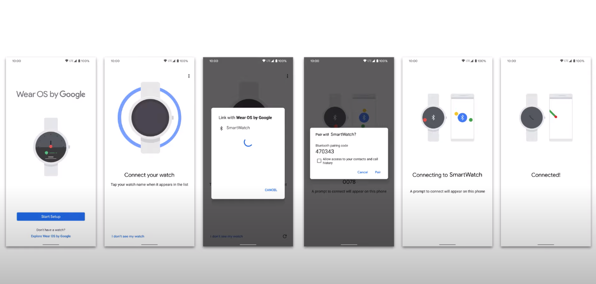

## 配套设备配对
Google 官方为什么要提供 Companion device 相关的 API 呢？

一般情况下，手机或平板要连接外围设备的话大概的流程是：

发起扫描（Wifi 或 蓝牙）->请求位置权限(可能还有 BLUETOOTH_ADMIN 权限)-> 开始扫描 -> 扫描到结果开始连接

我们知道 WiFi 信息，蓝牙设备如 Beacon 信标的信息会暴露用户的位置信息，所以在进行 Wifi 或蓝牙扫描时，系统需要应用向用户
请求位置权限，但用户通常并不明白这些，用户通常只知道 GPS 定位之类的才需要位置信息，所以这个地方很容易对用户造成困扰，用户
如果拒绝了授予应用权限，则应用在相关功能上会出现不好的体验。

官方为了解决这个问题，让整个过程对用户来讲更平滑，就引入了 CDM(CompanionDeviceManager)。
- 由系统会完成隐私敏感的扫描操作，
- 应用就不需要请求位置相关权限了，而且即使用户关闭了位置功能， CDM 扫描还可以工作。

对于开发者来讲：
- 声明 REQUEST_COMPANION_RUN_IN_BACKGROUND 权限，应用可在后台运行不受电池优化限制。
- 声明 REQUEST_COMPANION_USE_DATA_IN_BACKGROUND 权限，应用可在后台不受限制的使用数据。
- 还可以通过系统对话框来设置 notification ,而不需要通过 deep-linking 跳转到应用设置页。

这些特权对设备电池及数据使用会带来不好的影响，所以要在需要时再使用。

### 实现步骤
可以使用 Filter 根据类型（BLE 或 Wifi）或设备名称自定义请求对话框里显示的内容。
- manifest 中声明 <uses-feature android:name="android.software.feature_companion_device_setup"/>.
- 检查 Bluetooth 或 Wi-Fi 是打开的
- 在  CompanionDeviceManager.Callback 中处理结果，使用 CompanionDeviceManager.EXTRA_DEVICE 键来获取返回的设备对象，
根据不同的类型会返回不同的设备对象：
  - 经典蓝牙是 BluetoothDevice 对象
  - BLE 是 android.bluetooth.le.ScanResult 对象
  - Wifi 类型是  android.net.wifi.ScanResult 对象

```
class MyDeviceSelectionActivity : Activity() {

    private val deviceManager: CompanionDeviceManager by lazy(LazyThreadSafetyMode.NONE) {
        getSystemService(CompanionDeviceManager::class.java)
    }

    override fun onCreate(savedInstanceState: Bundle?) {
        super.onCreate(savedInstanceState)
        // ...

        // To skip filtering based on name and supported feature flags (UUIDs),
        // don't include calls to setNamePattern() and addServiceUuid(),
        // respectively. This example uses Bluetooth.
        val deviceFilter: BluetoothDeviceFilter = BluetoothDeviceFilter.Builder()
                .setNamePattern(Pattern.compile("My device"))
                .addServiceUuid(ParcelUuid(UUID(0x123abcL, -1L)), null)
                .build()

        // The argument provided in setSingleDevice() determines whether a single
        // device name or a list of device names is presented to the user as
        // pairing options.
        val pairingRequest: AssociationRequest = AssociationRequest.Builder()
                .addDeviceFilter(deviceFilter)
                .setSingleDevice(true)
                .build()

        // When the app tries to pair with the Bluetooth device, show the
        // appropriate pairing request dialog to the user.
        deviceManager.associate(pairingRequest,
                object : CompanionDeviceManager.Callback() {

                    override fun onDeviceFound(chooserLauncher: IntentSender) {
                        startIntentSenderForResult(chooserLauncher,
                                SELECT_DEVICE_REQUEST_CODE, null, 0, 0, 0)
                    }

                    override fun onFailure(error: CharSequence?) {
                        // Handle failure
                    }
                }, null)
    }

    override fun onActivityResult(requestCode: Int, resultCode: Int, data: Intent) {
        when (requestCode) {
            SELECT_DEVICE_REQUEST_CODE -> when(resultCode) {
                Activity.RESULT_OK -> {
                    // User has chosen to pair with the Bluetooth device.
                    val deviceToPair: BluetoothDevice = 
                            data.getParcelableExtra(CompanionDeviceManager.EXTRA_DEVICE)
                    deviceToPair.createBond()
                    // ... Continue interacting with the paired device.
                }
            }
        }
    }
}
```

官方展示的 Google 手表的配对过程图如下：




